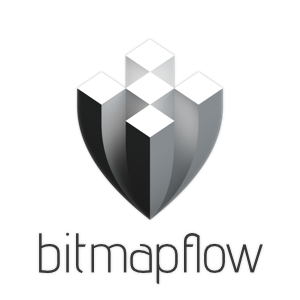
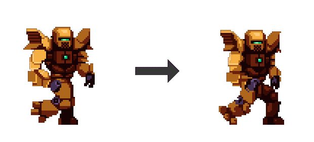

Bitmapflow is a tool to help you generate inbetweens for animated sprites. In other words, it makes your animations smoother. It uses [optical flow](https://en.wikipedia.org/wiki/Optical_flow) to try to guess how the pixels move between frames, and blends them accordingly. The results are far from perfect, and probably require some editing by hand afterwards, but sometimes it can produce decent results.

It supports loading and saving animated gifs, spritesheets and individual frames.

Example:

## Usage

[You can download the executables here](https://github.com/Bauxitedev/bitmapflow/releases). (Windows only for now). You'll need to install the [Visual Studio Redistributable](https://aka.ms/vs/16/release/vc_redist.x64.exe) first (unless you already have Visual Studio 2015 or newer installed). Other than that, it should work out of the box.

A video tutorial on how to use the program can be found here.

TODO put your video here

A short summary:

1. Drag and drop your image into the program. It can be an animated gif, a spritesheet, or individual frames. If you don't have any sprite laying around you can find some in the `examples` folder in this repository.
2. Tweak the parameters.
3. Open the File menu to export the results as an animated gif, a spritesheet, or individual frames.

If you use big sprites with lots of frames, you may need to wait a while after tweaking the parameters for the processing to complete, since calculating optical flow can be quite CPU intensive.

A short explanation of the parameters follows.

### Basic Parameters

- **Inbetweens**: this decides how many inbetweens to generate. For example, if your input animation has 12 frames, and you generate 2 inbetweens, your output animation now has 36 frames. The more inbetweens you have, the smoother your animation gets.
- **Loop seamlessly**: if enabled, the animation will loop seamlessly. Disable this for one-shot animations, like explosions.
- **Motion multiplier**: if this value isn't 1x, it will exaggerate the motion if it's >1x, or diminish it if it's <1x. E.g. If you put it at 2x, the motion will go twice as fast; if it's 0.5x, the motion will be cut in half.
- **FPS**: on the bottom right of the screen, you can change the speed of the input animation, in frames per second (FPS). The output animation will have a higher FPS, depending on the amount of inbetweens. E.g. If your input animation runs at 10 FPS, generating 1 inbetween means your output animation now runs at 20 FPS. Note that this parameter has no effect on the inbetween generation process, it's only used for displaying your sprite. (it *does*, however, affect the animation speed of exported gifs)

### Advanced Parameters

- **Flow algorithm**:  You can decide which optical flow algorithm to use. The default is SimpleFlow, which works well in most cases. If it doesn't work for you, you can switch to DenseRLOF, which works better for some sprites. Both algorithms have different unique parameters to tweak, see below. Note that DenseRLOF seems a little unstable, it occasionally crashes for no reason (I'm using an external library, so I don't have any control over this).

I could explain all the advanced parameters in detail, but since they describe internal optical flow algorithm parameters, they require some background knowledge about the algorithm before they start to make sense. You can check the [official documentation for SimpleFlow](https://docs.opencv.org/master/d2/d84/group__optflow.html#gaf23c367519903ed2384e9532e43c7032) or the [official documentation for DenseRLOF](https://docs.opencv.org/master/d2/d84/group__optflow.html#ga0fc536362c239654322d9015f6efcecd) for more details.

You'll need to experiment a lot to find parameters that work well, although the default parameters seem to work decently for a lot of sprites. See my video tutorial on the subject.

[TODO video goes here]

### Tips

The algorithm works best for sprites that only have movement in the two-dimensional plane. That means, things only move horizontally, vertically, or diagonally, *not* towards or away from the viewer.

Additionally, the algorithm assumes the brightness of pixels doesn't change between frames. That means, things like explosions, particle effects and blinking lights won't work that well, because they generally start bright and become dimmer over time.

Finally, if you feed pixel art into the program, make sure the pixel art isn't upscaled. It should be at its original resolution.

## Compiling from source

If you want to dig through the source code and compile Bitmapflow yourself, you'll need to jump through some hoops. The program is written in Godot using godot-rust, so the project consists of two parts:

1. The Godot project, found in the `godot` folder.
2. The rust crate, found in the `rust` folder.

To get it to work, you'll need to install the following things on your system first:

- Godot 3.2.3+
- Cargo (included in Rustup)
- OpenCV 4.x (see the documentation of [OpenCV-rust](https://github.com/twistedfall/opencv-rust#getting-opencv) on how to get OpenCV)

I'm going to assume you're on Windows, but technically speaking this should work on other platforms as well, but the details and filenames will be different.

Getting it to work:

1. Go to the `rust` folder and run `cargo build --release`.
2. After a while this should produce a DLL file called `bitmapflow_rust.dll` in the `rust/target/release` folder (On Linux this file will be called `libbitmapflow_rust.so`). Copy this file to the `godot` folder.
3. Now open Godot and run the project in the `godot` folder.

That's all.

## FAQ

On Windows, the program crashes after the splash screen, or I get an error about vcruntime140.dll not being found. What to do?

- Install the [Visual Studio Redistributable](https://aka.ms/vs/16/release/vc_redist.x64.exe).

I get some weird OpenCV error about sizes or something after loading my sprite?

- Try reducing the "layers" parameter in the Advanced parameters section, or click the big Reset button at the bottom of the sidebar. If that doesn't work, your sprite may be too small. Try using a bigger sprite. Also try using SimpleFlow instead of DenseRLOF, it's more versatile and breaks less often.

## License

The code is licensed under MIT. The included example sprites (in the `examples` folder) are licensed as follows:

- [CC-BY-3.0 License](http://creativecommons.org/licenses/by/3.0/), created by Luis Zuno (ansimuz):
  - [Hell-Hound-Files](https://opengameart.org/content/hell-hound-character)
  - [Sideview Sci-Fi](https://opengameart.org/content/sideview-sci-fi-patreon-collection)
  - [underwater-diving-files](https://opengameart.org/content/underwater-diving-pack)
  - [warped_caves_files](https://opengameart.org/content/warped-caves-pixel-art-pack)
  - [warped_city_files](https://opengameart.org/content/warped-city)
- [CC-BY-AS 3.0 License](http://creativecommons.org/licenses/by-sa/3.0/), created by Balmer and Stephen Challener:
  - [ars_notoria](https://opengameart.org/content/bosses-and-monsters-spritesheets-ars-notoria)
